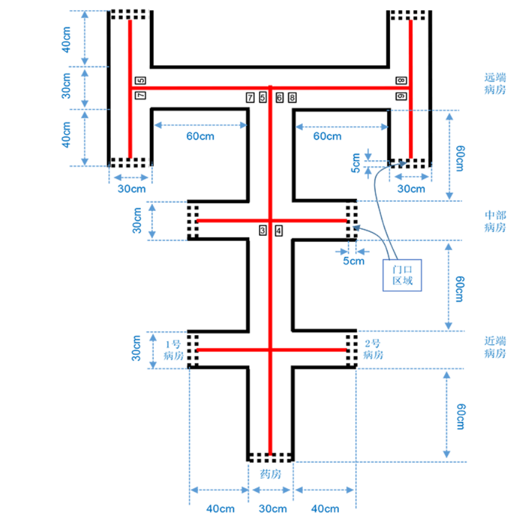

[← 首页](.) | 最后更新：2026-07-17

# TI杯2021年全国大学生电子设计竞赛赛题 F—智能送药小车

## 参赛注意事项

1. 11月4日8:00竞赛正式开始。本科组参赛队只能在【本科组】题目中任选一题；高职高专组参赛队在【高职高专组】题目中任选一题，也可以选择【本科组】题目。
2. 参赛队认真填写《登记表》内容，填写好的《登记表》交赛场巡视员暂时保存。
3. 参赛者必须是有正式学籍的全日制在校本、专科学生，应出示能够证明参赛者学生身份的有效证件（如学生证）随时备查。
4. 每队严格限制3人，开赛后不得中途更换队员。
5. 竞赛期间，可使用各种图书资料和网络资源，但不得在学校指定竞赛场地外进行设计制作，不得以任何方式与他人交流；包括教师在内的非参赛队员必须迴避，对违纪参赛队取消评审资格。
6. 11月7日20:00竞赛结束，上交设计报告、制作实物及《登记表》，由专人封存。

---

**【本科组】**

## 一、任务

设计并制作智能送药小车，模拟完成在医院药房与病房间药品的送取作业。

院区结构示意如图1所示。院区走廊两侧的墙体由黑实线表示；走廊地面上画有居中的红实线，并放置标识病房号的黑色数字可移动纸张。药房和近端病房号（1、2号）如图1所示位置固定不变，中部病房和远端病房号（3—8号）测试时随机设定。

工作过程：参赛者手动将小车摆放在药房处（车头投影在门口区域内，面向病房），手持数字标号纸张由小车识别病房号，将约200g药品一次性装载到送药小车上；小车检测到药品装载完成后自动开始运送；小车根据走廊上的标识信息自动识别、寻径将药品送到指定病房（车头投影在门口区域内），点亮红色指示灯，等待卸载药品；病房处人工卸载药品后，小车自动熄灭红色指示灯，开始返回；小车自动返回到药房（车头投影在门口区域内，面向药房）后，点亮绿色指示灯。

> **图1 院区结构示意图**
>
> 
>
> - 近端病房：1、2号，位置与编号固定。
> - 中部与远端病房：3—8号，测试时编号随机设定。
> - 红实线为行驶引导线；黑实线为走廊墙体；黑白相间虚线框为门口区域。

## 二、要求

### 1. 基本要求

1. 单个小车运送药品到指定的近端病房并返回到药房。要求运送和返回时间均小于20s，超时扣分。
2. 单个小车运送药品到指定的中部病房并返回到药房。要求运送和返回时间均小于20s，超时扣分。
3. 单个小车运送药品到指定的远端病房并返回到药房。要求运送和返回时间均小于20s，超时扣分。

### 2. 发挥部分

1. 两个小车协同运送药品到同一指定的中部病房。小车1识别病房号装载药品后开始运送，到达病房后等待卸载药品；然后，小车2识别病房号装载药品后启动运送，到达自选暂停点后暂停，点亮黄色指示灯，等待小车1卸载；小车1卸载药品、开始返回，同时控制小车2熄灭黄色指示灯并继续运送。要求从小车2启动运送开始，到小车1返回到药房且小车2到达病房的总时间（不包括小车2黄灯亮时的暂停时间）越短越好，超过60s计0分。
2. 两个小车协同到不同的远端病房送、取药品。小车1送药，小车2取药。小车1识别病房号装载药品后开始运送，小车2于药房处识别病房号等待小车1的取药开始指令；小车1到达病房后卸载药品、开始返回，同时向小车2发送启动取药指令；小车2收到取药指令后开始启动，到达病房后停止，亮红色指示灯。要求从小车1返回开始，到小车1返回到药房且小车2到达取药病房的总时间越短越好，超过60s计0分。
3. 其他。

## 三、说明

1. 院区可由铺设白色亚光喷绘布制作。走廊上的黑线和红线由喷绘或粘贴线宽约为1.5cm—1.8cm的黑色和红色电工胶带制作。药房和病房门口区域指其标线外沿所涵盖的区域，其标线为约2cm黑白相间虚线。图1中非黑色、非红色仅用于识图解释，在实测院区中不出现。
2. 标识病房的黑色数字可在纸张上打印，数值为1—8，每个数字边框长宽为8cm×6cm，将“数字字模.pdf”文件按实际大小打印即可；数字标号纸张可由无痕不干胶等粘贴在走廊上，其边框距离实线约2cm；图1中标识远端病房的两个并排数字边框之间距离约2cm。
3. 小车长×宽×高不大于25cm×20cm×25cm，使用普通车轮（不能使用履带或麦克纳姆轮等特殊结构）。两小车均由电池供电，小车间可无线通信，外界无任何附加电路与控制装置。
4. 作品应能适应无阳光直射的自然光照明及顶置多灯照明环境，测试时不得有特殊照明条件要求。
5. 每项测试开始时，只允许按一次复位键，装载药品后即刻启动运送时间计时，卸载药品后即刻启动返回时间计时。计时开始后，不得人工干预。每个测试项目只测试一次。
6. 小车于药房处识别病房号的时间不超过20s。发挥部分（1）中自选暂停点处的小车2与小车1的车头投影外沿中心点的红实线距离不小于70cm。
7. 有任何一个指示灯处于点亮状态的小车必须处于停止状态。两小车协同运送过程中不允许在同一走廊上错车或超车。
8. 测试过程中，小车投影落在黑实线上或两小车碰撞将被扣分；小车投影连续落在黑实线上超过30cm或整车越过黑实线，或两小车连续接触时间超过5s，该测试项计0分。
9. 参赛者需自带2套数字标号纸张，无需封箱。

## 四、评分标准

| 类别 | 项目 | 主要内容 | 满分 |
| :--- | :--- | :--- | ---: |
| 设计报告 | 方案论证 | 比较与选择，方案描述 | 3 |
|  | 理论分析与计算 | 数字识别方法，自动寻径方法 | 6 |
|  | 电路与程序设计 | 电路设计，程序设计 | 6 |
|  | 测试方案与测试结果 | 测试方案及测试条件，测试结果及其完整性，测试结果分析 | 3 |
|  | 设计报告结构及规范性 | 摘要，设计报告正文的结构，图表的规范性 | 2 |
|  | **合计** |  | **20** |
| 基本要求 | 完成第（1）项 | 近端病房送药并返回 | 12 |
|  | 完成第（2）项 | 中部病房送药并返回 | 18 |
|  | 完成第（3）项 | 远端病房送药并返回 | 20 |
|  | **合计** |  | **50** |
| 发挥部分 | 完成第（1）项 | 两车协同向同一中部病房送药 | 23 |
|  | 完成第（2）项 | 两车协同向不同远端病房送、取药 | 21 |
|  | 其他 |  | 6 |
|  | **合计** |  | **50** |
| **总分** |  |  | **120** |

## 资料来源

- 用户提供的赛题截图与场地图（`docs_2021/pic1.png`）。
- [2021年全国大学生电子设计竞赛 F 题官方题面](https://nuedc.org/problems/2021_F%E9%A2%98_%E6%99%BA%E8%83%BD%E9%80%81%E8%8D%AF%E5%B0%8F%E8%BD%A6.pdf)（用于核对文字转录）。
