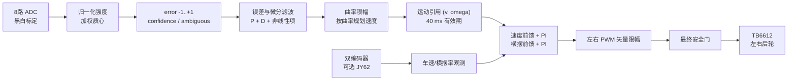
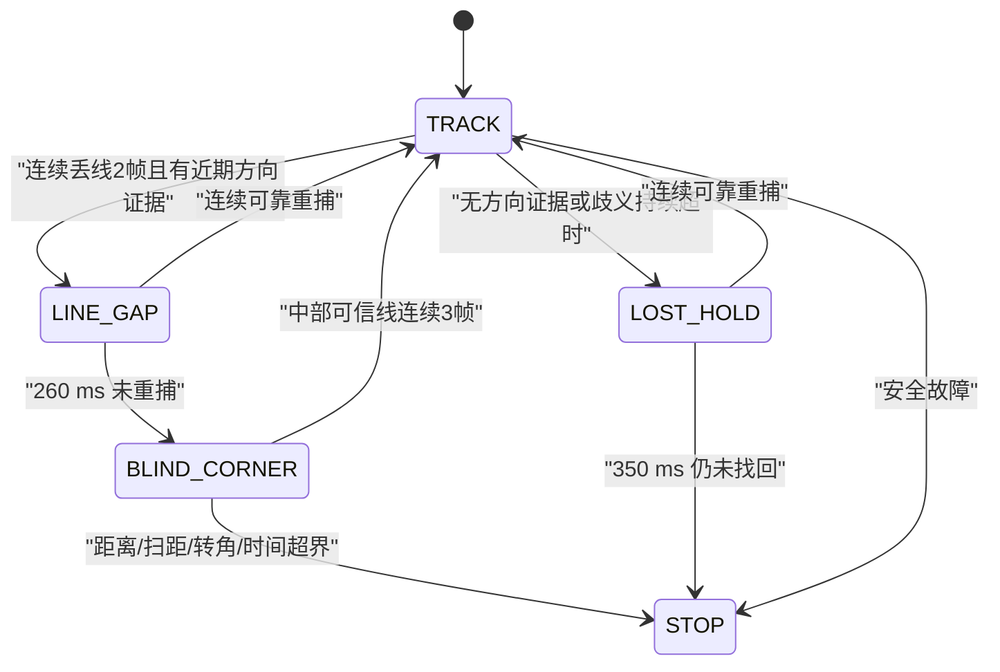

# R3 三轮后驱高速寻迹架构方案

## 1. 目标与边界

目标不是堆叠特殊赛道判断，而是用短、清晰、可验证的控制链覆盖直线、连续弯、短缺口、急弯失线和真实故障：

- 正常可见线路始终使用连续控制，不把每一种灰度位型写成一个动作。
- 高速来自可靠位置估计、按曲率降速和轮速闭环，而不是单纯提高基础 PWM。
- 丢线恢复必须有近期方向证据：`LINE_GAP` 保持前进续弯，确认进入 `BLIND_CORNER` 后才允许双轮反向原地调姿。每个阶段都有时间上界，盲转另有距离与角度上界；没有方向证据就减速停车。
- 所有平台尺寸、接线符号和增益集中在一个配置文件，算法模块不直接操作硬件。
- 未实测的机械量明确标记为假设，不把“编译通过”表述成“实车跑通”。

## 2. 参考项目与采用范围

| 来源 | 可验证信息 | 本工程采用的原则 | 未采用内容 |
|---|---|---|---|
| [Pololu QTR 官方用法](https://pololu.github.io/qtr-sensors-arduino/md_usage.html) | 分通道标定、0~7000 加权线位置和独立丢线语义 | 每通道黑白标定、加权质心、可见性与位置分离 | Arduino API/驱动代码 |
| [Motoko Ice Dragon](https://github.com/michalnand/motoko_ice_dragon) / [ISTROBOT 2024 成绩](https://robotika.sk/contest/2024/index.php?page=results) | 开源竞赛车及比赛结果；项目使用传感器质量、几何和历史误差调速 | 置信度、曲率速度包络、受限前进弧线恢复 | BLDC、LQR 和其高端硬件专用实现 |
| [Semreh V2](https://github.com/Tamandutech/LineFollower_SemrehV2_Code) / [RoboCore 2024 成绩](https://events.robocore.net/rcbr-2024/results/27) | 8 路传感器、周期编码器测速、PD 与分段速度策略 | 固定周期、PD 外环和速度闭环分层 | 无许可证源码不复制，只参考公开架构 |
| [Oguten/Kabas 论文](https://arxiv.org/abs/2111.04149) / [配套 STM32 仓库](https://github.com/sametoguten/STM32-Line-Follower-with-PID) | 传感器阵列、PID 与速度控制实验 | 误差和执行器闭环分离、参数需实验整定 | 示例实现细节；不继承其数值边界问题 |
| [`R1 稳定高速寻迹小车通用框架`](../../R1series/底层寻迹/稳定高速寻迹小车通用框架.md) | 同 MCU、灰度板、驱动和软件基础 | 经过本仓库验证的模块边界、原子引用和测试方式 | 前驱平台的尺寸、符号和未验证参数 |

外部项目只用于验证控制思路。R3 代码是在本仓库接口上独立实现，避免把不同电机、轮距、传感器位置和许可证条件混入工程。

## 3. 总体控制链



固定 10 ms 周期与 R1 的 ADC、编码器和 Keil 工程一致，也处在所参考竞赛车常见的 4~10 ms 控制量级内。所有导数和积分均显式带时间尺度；只有测得最坏执行时间后才应缩短周期。

### 3.1 线路观测

每通道使用现场白/黑基准归一化。黑线强度作为权重，位置为：

```text
position = sum(sensor_position[i] * strength[i]) / sum(strength[i])
error    = (position - 3500) / 3500
```

位置范围 0~7000，再归一到 -1~+1。`line_visible`、`confidence` 和 `ambiguous` 分开表达，避免用一个魔法位置值同时表示“左边”“右边”和“没看到线”。宽线、分离多峰或路口只允许短时沿最近可信曲率限速前进，持续 220 ms 仍不可靠就退出旧曲率。

### 3.2 连续线路外环

可靠线路下先低通误差和微分，再生成曲率：

```text
kappa = Kp * softened_error
      + K2 * softened_error * abs(softened_error)
      + Kd * derivative_scale * filtered_derivative
omega = v * kappa
```

中心软化降低直道噪声，二次项只在大偏差时增强急弯能力。速度随 `|kappa|` 连续下降，并受最小弯速、最大轮速、横摆率和内轮速度地板共同约束。这样直道和弯道之间没有模式跳变。

### 3.3 后驱底盘闭环

R3 仍是差速运动学：

```text
left_speed  = v + wheel_track * omega / 2
right_speed = v - wheel_track * omega / 2
```

但相较小车，0.2142 m 轮距、较长传感器前视、约 1 kg 质量和前万向轮会提高惯量、转弯轮速差与摆振风险，因此不能直接复用 R1 增益。底盘采用：

- 共同速度通道：目标速度前馈 + 车体平均速度 PI。
- 差动横摆通道：运动学前馈 + 编码器/JY62 横摆率 PI。
- 共同/差动矢量限幅：饱和时保持转向优先级，带反算抗积分饱和。
- 目标斜坡：加速慢、减速快，换向先回零；电机方向翻转另插入一拍
  `PWM=0` 的非阻塞互锁，减少后驱甩尾和 TB6612 冲击。

## 4. 状态与恢复



- `TRACK`：连续曲率寻迹；短时宽线/多峰限速，不永久保持旧转向。
- `LINE_GAP`：使用 350 ms 内确认的最近转向方向，前进速度取 `max(0.16 m/s, 有效最高速度×0.32)`，0.70 m/s 档为 `0.224 m/s`；横摆从 `1.20` 增至 `1.60 rad/s`，内轮速度地板为 0，不允许短缺口恢复阶段倒车。
- `BLIND_CORNER`：目标前进速度为 0、横摆为 `2.00 rad/s`，只在该状态允许内轮反转。按 0.2142 m 轮距，右转左右轮约为 `+0.214/-0.214 m/s`，左转镜像；低速调试上限同时限制两轮绝对速度。
- `LOST_HOLD`：无可信方向时只低速短暂直行等待重捕，超时停车。
- `STOP`：锁存停止，只有人工重新启动才清除。

所有重捕都要求连续多帧且置信度达标；盲转重捕还限制位置不能过分靠边，避免单帧噪声让车辆从恢复状态猛跳回高速。盲转重新看到中部线时，三帧内前进目标约按 `0.04/0.08/0.12 m/s` 建立，同时快速卸载旧横摆，再回到连续曲率跟踪。

## 5. 安全设计

1. 运行前强制完成现场标定，至少 6/8 通道有效。
2. 主循环发布带时限的运动引用；ISR 拒绝过期或空引用。
3. 编码器单周期脉冲越界、持续有命令但无脉冲、实测方向持续相反、
   NaN/Inf、灰度任务或底盘 ISR 超期均锁停。
4. LINE_GAP/LOST_HOLD 有时间上界，BLIND_CORNER 另有距离、扫距、转角和时间上界；硬安全边界先于同周期重捕判定，最终 PWM 前再次检查停止条件。
5. PWM 限为 7800/8000，并由速度/横摆共同限幅；零命令明确关闭两路方向引脚。
6. ADC-DMA 单帧超时可退化为单点值并由线路滤波吸收；标定中任一超时会
   拒绝整批基准，运行中连续两帧退化锁存 `STOP 15`。
7. 当前实车已启用 JY62 闭环；右转时 OLED 原始 `Z<0`，乘以配置符号 `-1` 后控制横摆 `C>0`。失去新鲜数据时退回编码器观测并将速度引用同帧硬钳到 0.40 m/s。
8. NMI/HardFault 尽力关断已初始化的电机输出后系统复位；独立 WWDT、STBY 硬关断和物理急停仍属于实车高速前的硬件验收项。

电控的真实边界仍由硬件决定。用户电机资料标注 3.2 A 堵转电流，而 [TB6612FNG 官方页](https://toshiba.semicon-storage.com/us/semiconductor/product/motor-driver-ics/brushed-dc-motor-driver-ics/detail.TB6612FNG.html)给出 1.2 A 平均、3.2 A 峰值输出。软件斜坡和堵转检测只能降低风险，不能替代足够的驱动电流、散热和保险保护。

## 6. 验收顺序

| 阶段 | 通过条件 | 未通过时不进入 |
|---|---|---|
| 静态检查 | 尺寸/CPR/引脚表与实物一致 | 上电 |
| 架空测试 | 两轮命令、编码器、灰度和横摆符号全部正确 | 落地 |
| 低速直线 | 0.25~0.35 m/s 无持续振荡，左右实测速度跟随目标 | 弯道调参 |
| 低速全赛道 | 正常弯连续 TRACK，缺口可恢复，故障能锁停 | 快速档 |
| 分级提速 | 每级完整多圈，最差弯仍有余量，驱动不过热不保护 | 下一速度级 |
| 高速验收 | 目标赛道冷/热电池均能重复跑通，有日志和停车测试证据 | 宣称稳定高速 |

当前已切换到 0.70 m/s 快速档并启用 JY62；若数据不新鲜，安全降级上限仍会压到 0.40 m/s。0.95 m/s 只是配置允许的人工上限，不是当前已验证速度。
