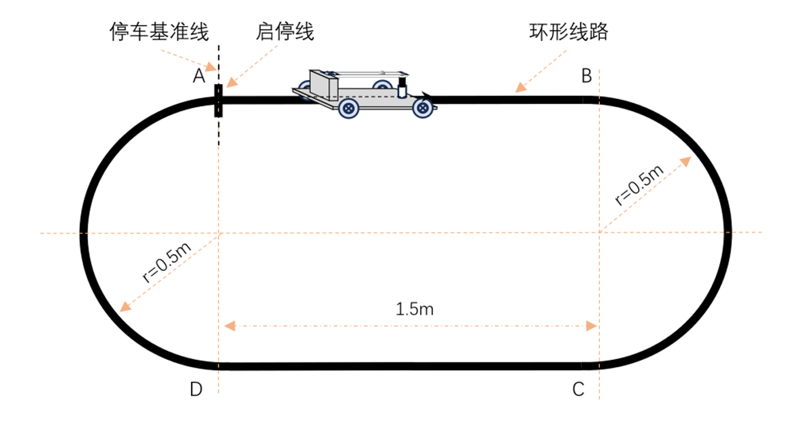
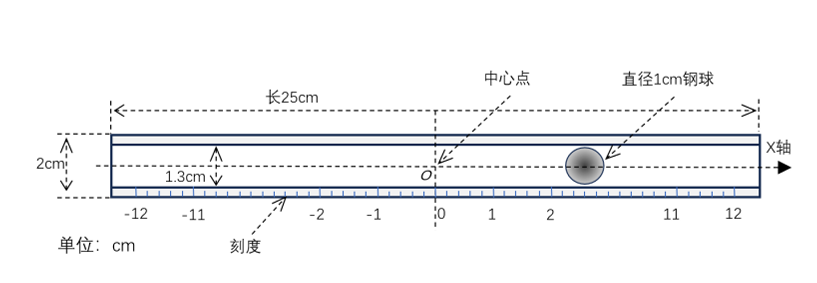
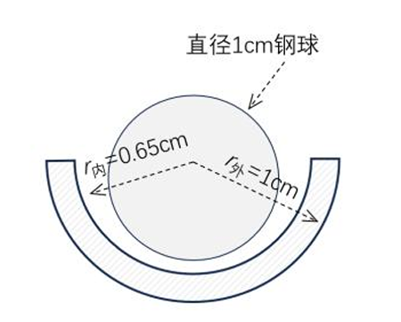

# 2026年全国大学生电子设计竞赛江苏赛区赛（TI杯）

## 暨模拟电子系统设计专题赛选拔赛赛题

# 车载平衡滚球运动控制系统（H题）

## 一、任务

设计制作一辆载有平衡滚球运动控制装置的循线小车，小车可沿黑色环形路线行驶，行驶过程中钢球可在滚球运动控制装置内保持相对稳定。

车载平衡滚球运动控制系统由小车、带凹槽的摆杆、摆杆控制机构和钢球组成，摆杆左端用铰链或者合页固定，距离小车平板高度
h≥5cm，另一端连接至摆杆角度控制机构，可控制钢球稳定在指定位置。

## 图1 小车行驶路线示意图

## 图2 车载平衡滚球运动控制系统结构参考示意图

## 二、要求

### 1.

安装摆球位置监测图传装置。装置由发送和接收模块组成，图传发送模块须稳固安装在小车上，接收模块可连接显示存储装置并整体置于环形线路以外，要求能稳定实时显示钢球在凹槽中滚动的画面，并完整记录每次测试时钢球运动的视频且能按要求回放。（6分）

### 2.

小车置于 A 点，按键启动后沿黑线顺时针行驶一圈并停到 A
点，计时停止并显示行驶总时间，要求行驶总时间≤20s，停车偏差≤2cm。（16分）

### 3.

小车在静止状态时，要求摆杆控制装置控制小球从摆杆中心点 O
往+5cm处运行，到达后折返，再运行到-5cm处并稳定在该点附近，要求运行时间≤5s，±5cm处的最大误差绝对值≤1cm。（13分）

### 4.

小车置于 A 点，钢球置于中心点 O，按键启动后沿黑线顺时针行驶并通过 B
位置，AB间行驶时间≤8s，行驶过程中钢球须稳定在摆杆中心点附近，误差绝对值≤1cm。（20分）

### 5.

小车置于 A 点，钢球置于中心点 O，按键启动后沿黑线顺时针行驶一圈并通过 A
位置，整圈行驶总时间≤30s，要求行驶过程中钢球须稳定在摆杆中心点附近，误差绝对值≤1cm。（20分）

### 6.

小车置于 A
点，钢球置于摆杆任意指定位置，按键启动后沿黑线顺时针行驶一圈并通过 A
位置，整圈行驶总时间≤30s，要求行驶过程中钢球能稳定在摆杆上的任意指定位置附近，误差绝对值≤1cm。（20分）

## 三、说明

### 图3 摆杆结构示意图

小车运动场地可以参照图1用白色广告布喷绘制成，环形线路为黑线，线宽为1.8±0.2cm。

作品中的车身尺寸长宽不超过35cm（长）×25cm（宽）。小车采用轮式驱动，由车载电池供电。

小车循迹模块只能使用红外光电模块，数量不限。小车必须有启动按键和显示装置。

摆球位置监测图传装置的发送模块须稳定安装于车体，摄像头可固定在摆杆凹槽上方，回传画面能覆盖整个摆杆。

## 四、评分标准

  项目       主要内容                                       满分
  ---------- ---------------------------------------------- ------
  设计报告   方案论证、小车循迹控制方案                     3
  设计报告   理论分析、小车循迹控制理论、摆杆系统控制理论   5
  设计报告   电路与程序设计                                 5
  设计报告   测试方案与测试结果                             4
  设计报告   结构及规范性                                   3
  要求       完成第1项                                      6
  要求       完成第2项                                      16
  要求       完成第3项                                      13
  要求       完成第4项                                      20
  要求       完成第5项                                      20
  要求       完成第6项                                      20

总分：120
