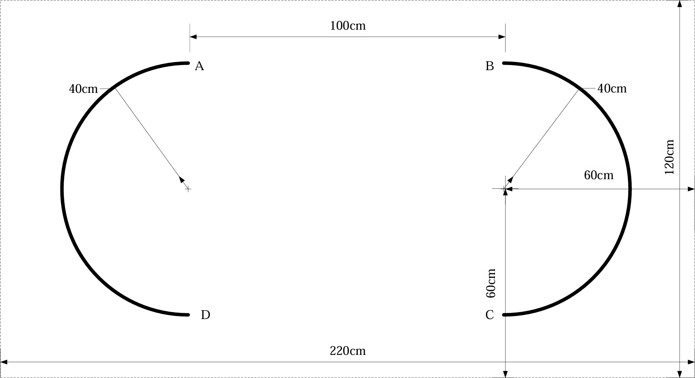

# 自动行驶小车

## 摘要

针对 2024 年全国大学生电子设计竞赛江苏赛区（TI杯）自动行驶小车（H题）中无外部标记、仅含两段半圆弧黑线的循迹任务，设计了一套以 MSPM0G3507 为主控的差速轮式小车控制系统。系统以 8 路灰度传感器获得黑线横向偏差，以编码器构建左右轮速度闭环，并结合 JY62 惯性测量单元提供的航向信息完成失线段航向保持。控制层采用“灰度加权质心—纯追踪曲率控制—差速运动学逆解—增量式 PI”闭环结构；任务层采用路段状态机，将巡线、航向对齐、对角线直冲、黑线重捕获和圈数计数串联，实现任务（1）至任务（4）的统一调度。

针对题目中 A、B、C、D 点没有额外标记的问题，设计以弧线转角、里程计和位姿邻近判据协同确认的过点机制，并在已知点执行位姿快照以抑制累计误差。本文给出硬件组成、关键控制公式、软件流程和可复现实测方案。实车时间、成功率及连续四圈结果须按第五章测试表补录后作为最终结论。

**关键词：** MSPM0G3507；自动循迹；差速控制；纯追踪；惯性导航；状态机

## 1. 设计方案与工作原理

### 1.1 预期实现目标定位

本设计面向 H 题规定场地：小车从指定起点出发，在半径 40 cm 的两段黑色半圆弧线与两条直线组成的封闭路径上自动行驶。系统须完成 A→B 停车、单圈顺逆向运行以及按任务（3）路线连续运行 4 圈，并在起停和经过关键点时给出声光提示。设计遵守 MSPM0 系列 MCU 控制、轮式前进、车载供电、无摄像头和不依赖场外设备等限制。

### 1.2 技术方案分析比较

1. **循迹方案。** 方案一为单路红外开关循迹，结构简单但无法获得横向误差大小，难以兼顾弧线稳定性与速度；方案二为摄像头视觉循迹，信息量较大但题目明确禁止安装摄像头；方案三为 8 路灰度传感器阵列。方案三可通过黑线传感器位置的加权质心形成连续偏差，满足题目限制且计算量小，故采用方案三。
2. **失线与过点导航方案。** 方案一仅依赖灰度阈值，在无标记端点处易受光照和瞬态偏差影响；方案二仅依赖编码器里程计，存在轮胎打滑累积误差；方案三将灰度特征、编码器里程与 JY62 航向/位姿信息融合。方案三能够以多条件相互校验并在已知点回正位姿，因此用于任务状态推进。
3. **电机控制方案。** 开环 PWM 难以抑制电池电压和负载变化；位置式 PID 便于理解但对输出限幅与积分累积较敏感；增量式 PI 直接输出 PWM 增量、实现简单且适合 5 ms 固定周期的速度闭环，故用于左右轮独立调速。

### 1.3 系统结构工作原理

系统由感知、控制、执行和提示四部分组成。8 路灰度模块经 3 根地址线与 1 根数据线分时采样，输出黑线位置；双路编码器反馈左右轮瞬时速度；JY62 通过 UART 输出 yaw 与 Z 轴角速度；MSPM0G3507 在 5 ms 定时中断内完成采样、状态机、速度闭环与 PWM 刷新；TB6612 双 H 桥驱动两台直流减速电机；OLED、LED 与蜂鸣器显示运行状态并完成关键点提示。

| 模块 | 主要器件/接口 | 作用 |
|---|---|---|
| 主控 | MSPM0G3507 | 执行实时控制、任务状态机和外设管理 |
| 执行 | TB6612 + 直流减速电机 | 输出左右轮正向 PWM 驱动 |
| 速度反馈 | 13线编码器 | 获取轮速与累计里程 |
| 循迹 | 8路红外灰度模块 | 计算黑线横向偏差与重捕获状态 |
| 姿态 | JY62，UART 115200 bps | 提供航向与角速度，辅助失线段导航 |
| 人机交互 | OLED、LED、蜂鸣器 | 显示状态并在关键点声光提示 |

*表1 系统模块组成*

*图1 H题场地示意图*

### 1.4 功能指标实现方法

弧线段采用纯追踪模型，将灰度位置偏差 $y$ 转换为曲率 $\kappa$，并据当前线速度 $v$ 计算角速度命令 $\omega$；直线段保持较高基础速度，弧线段根据偏差与黑线覆盖数量自动降速。到达关键点时，任务层通过丢线、航向转角、里程和位姿邻近关系进行确认，并发出声光提示；达到目标圈数后将速度目标清零并保持停车。

### 1.5 测量、控制与分析处理

每个 5 ms 控制周期中，先读取编码器脉冲并换算车轮速度，再读取 8 路灰度状态、计算线位置与黑线数量；随后依据当前任务状态生成线速度和角速度目标，经差速逆解得到左右轮目标速度，最后由两路增量式 PI 计算 PWM。JY62 数据以 10 ms 节拍更新，用于航向对齐、直冲段 PD 保持和位姿积分。

## 2. 核心部件与电路设计

### 2.1 关键器件性能分析

MSPM0G3507 采用 Cortex-M0+ 内核，可提供定时器、PWM、GPIO 中断和 UART 等资源，满足 200 Hz 控制与多外设并行需求。TB6612 为双 H 桥电机驱动器，可分别控制左右直流电机的方向与 PWM 占空比。编码器采用 13 线霍尔编码器并配合 30:1 减速比，按 2 倍频计数时每轮一周对应 780 个计数；以轮周长 0.2105 m 和 200 Hz 周期可换算实时车速。

### 2.2 电路结构工作机理

电机方向引脚控制 TB6612 的 IN1/IN2 组合，TimerA 输出 10 kHz PWM，软件将占空比限幅至 0～7800/8000。灰度模块通过地址复用依次选通 8 路检测单元，减少 MCU 引脚占用。编码器 A/B 相上升沿触发 GPIO 中断；JY62 采用 `0x55` 帧头、11 字节数据帧解析欧拉角与角速度。电机电源与 MCU 逻辑电源应共地，并在实车接线时复核电流能力和抗干扰措施。

### 2.3 运动学与控制模型

设轮距为 $B$、车体线速度为 $v$、角速度为 $\omega$，则左右轮速度目标为：

$$
v_L=v-\frac{\omega B}{2},\qquad v_R=v+\frac{\omega B}{2}
$$

灰度传感器加权位置为：

$$
y=\frac{\sum(s_i p_i)}{\sum s_i}
$$

其中，$s_i$ 为第 $i$ 路黑线判定值，$p_i$ 为该传感器横向坐标。纯追踪曲率为：

$$
\kappa=\frac{2y}{L^2+y^2},\qquad \omega=-K_{steer}\cdot v\cdot\kappa
$$

增量式 PI 控制器以 $e(k)=v_{target}(k)-v_{measured}(k)$ 为速度偏差：

$$
PWM(k)=PWM(k-1)+K_p[e(k)-e(k-1)]+K_i e(k)
$$

本实现中 $K_p=400$、$K_i=300$，PWM 输出限制为 $\pm7800$，以防止控制量超过驱动器有效范围。

### 2.4 关键参数与接口

| 参数 | 取值 | 说明 |
|---|---|---|
| 控制周期 | 5 ms | TimerG 中断，控制频率 200 Hz |
| 轮距 $B$ | 0.130 m | 差速运动学参数 |
| 轮周长 | 0.2105 m | 编码器速度换算参数 |
| 编码器计数 | 780/rev | 13线×2倍频×30减速比 |
| 基础/弯道速度 | 300/185 mm·s⁻¹ | 灰度偏差分档速度 |
| PWM | 10 kHz，最大 7800 | TimerA 输出限幅 |
| JY62 串口 | 115200 bps | 航向与角速度数据输入 |

*表2 控制系统关键参数*

## 3. 系统软件设计分析

### 3.1 系统总体工作流程

上电后完成外设初始化、任务模式选择和传感器状态检查。定时中断中执行“编码器测速→JY62 数据更新→任务状态机→灰度巡线或航向直冲→目标轮速计算→PI 输出→PWM 刷新”流程；主循环负责 OLED 刷新、串口处理、按键及遥测显示。若 IMU 离线，系统不应将航向导航结果视作可用，应降级为循线调试或提示故障。

### 3.2 无标记场地的路段状态机

题目规定场地除两段半圆弧外不得设置额外标记，因此 A、B、C、D 不能通过十字黑线直接识别。软件将任务（3）及任务（4）分解为巡线 A→D、D 点切线对齐、D→B 对角线直冲、巡线 B→C、C 点对齐与前进、C→A 对角线直冲和回到 A 点后的航向恢复等状态。直冲段利用 JY62 的 yaw 与角速度构造 PD 航向保持，检测到黑线后连续确认重捕获，再切换回巡线状态。

| 状态 | 输入依据 | 主要动作 | 退出条件 |
|---|---|---|---|
| `LINE_AD` | 灰度线位置、位姿 | 沿 A→D 巡线 | 丢线且接近 D |
| `ALIGN_D` | yaw、角速度 | 对齐 D 点切线及 D→B 航向 | 航向误差连续满足阈值 |
| `BRIDGE_D_TO_B` | yaw、灰度重捕获 | 按目标航向直冲 | 重捕获黑线 |
| `LINE_BC` | 灰度线位置、位姿 | 沿 B→C 巡线 | 丢线且接近 C |
| `BRIDGE_C_TO_A` | yaw、灰度重捕获 | 按目标航向直冲 | 重捕获并接近 A |
| `STOP` | 圈数计数 | 速度目标清零、声光提示 | 任务结束 |

*表3 T4 任务状态机的主要状态*

### 3.3 关键模块程序设计

灰度模块以传感器横向位置为权重计算 `Gray_Line_Pos_mm`，并根据偏差绝对值及黑线数量选择直线、中速或弯道速度。编码器模块完成脉冲计数、速度换算和累计里程；JY62 模块校验帧头与校验和，维护在线超时状态；任务模块统一配置任务（1）至任务（4）的目标圈数与路线。关键接口包括 `Gray_Mode()`、`Get_Target_Encoder()`、`Incremental_PI_Left()`、`Incremental_PI_Right()`、`JY62_GetData()` 与 `Gray_TaskTick()`。

### 3.4 可靠性处理

为抑制单次噪声触发，航向对齐采用连续稳定周期确认；黑线重捕获也采用连续检测计数。对角线直冲设置最大距离与对齐超时保护，避免长期失线。到达已知点后调用位姿快照，将累计积分结果修正为场地坐标，从而降低多圈运行中的漂移。

## 4. 竞赛工作环境条件

### 4.1 软件环境

嵌入式程序采用 Keil uVision5 工程进行编译与下载，目标工程为 `MSPM0G3507_Project`；外设配置由 TI SysConfig 生成。调试阶段可使用串口助手、VOFA+ 或 DataScope 观察灰度位置、轮速、航向误差、状态编号和圈数。

### 4.2 硬件平台与场地

硬件平台包括 MSPM0G3507 控制板、TB6612 电机驱动、差速底盘、双路编码器、8 路灰度模块、JY62、OLED、LED、蜂鸣器和车载电池。测试场地按题目制作，面积不小于 220 cm×120 cm，半圆弧半径 40 cm、线宽约 1.8 cm，场地上不得添加用于辅助导航的标记。

### 4.3 调试条件与安全事项

先在架空状态确认左右轮方向、PWM 极性、编码器计数符号和急停逻辑，再在低速下完成灰度阈值、传感器安装位置与纯追踪增益整定。电机电源应满足峰值电流需求；调试期间避免车轮被障碍物卡死，并在改动供电或接线后重新验证共地与极性。

## 5. 作品成效总结分析

### 5.1 测试方案

按由简到难的顺序验证：首先进行 A→B 单弧线测试，确认巡线、端点判断与停车；其次完成任务（2）单圈，检查四段衔接与声光提示；再完成任务（3）逆向路线，检查对角线直冲、航向对齐和重捕获；最后进行任务（4）四圈连续运行，统计总用时、单圈波动、成功率、停车误差和失线恢复次数。每组条件至少重复 3 次，并记录电池电压和场地状态。

| 测试项目 | 评价指标 | 第1次 | 第2次 | 第3次 | 结论 |
|---|---|---|---|---|---|
| 任务（1）A→B | 用时≤15 s、停车与声光提示 | 待实测 | 待实测 | 待实测 | 待判定 |
| 任务（2）单圈 | 用时≤30 s、各点提示 | 待实测 | 待实测 | 待实测 | 待判定 |
| 任务（3）单圈 | 用时≤40 s、路径正确 | 待实测 | 待实测 | 待实测 | 待判定 |
| 任务（4）四圈 | 总用时、连续完成率 | 待实测 | 待实测 | 待实测 | 待判定 |

*表4 实车测试记录表（须由调试数据补录）*

### 5.2 成效与不足分析

从软件实现角度看，系统已将基础灰度巡线、编码器速度闭环、IMU 航向保持与 T4 状态机集成在统一控制框架中，能够针对无额外标记的场地建立可解释的过点与重捕获逻辑。该方案的优势是计算量低、模块边界清晰，并允许按任务切换目标圈数。其局限在于灰度特征会受传感器高度、环境光和线宽影响，里程计受轮胎打滑影响，IMU 存在零偏与航向漂移；因此最终性能必须以第五章实测数据为准，并根据实车日志迭代阈值与增益。

### 5.3 创新特色与展望

本设计以“循线优先、惯导补偿、已知点校正”的分层方式完成复杂路段控制：正常情况下由低成本灰度阵列完成闭环循迹，失线或跨越路段由 IMU 保持航向，重回已知点后以位姿快照抑制误差累积。后续可基于黑匣子遥测记录分析误差分布，采用自适应速度规划、灰度阈值在线校准和航向零偏补偿，提高不同场地和电池状态下的重复性。

## 6. 参考资料及文献

1. 2024年全国大学生电子设计竞赛江苏赛区（TI杯）自动行驶小车（H题）试题。
2. 项目资料：[H题路线分解与代码适配](../docs_2024/H题路线分解.md)。
3. 项目资料：[H题核心算法详解](../docs_2024/H题算法详解.md)。
4. Texas Instruments. *MSPM0G3507 Microcontrollers Technical Reference Manual*.
5. JY62 使用说明书：串口姿态数据帧与角速度数据格式。

## 7. 附件材料

### 7.1 工程文件与关键源代码

工程文件位于 `firmware/WHEELTEC_C07A_CAR_JY62_GapBridge/`。其中 `Control/control.c` 实现 5 ms 控制中断、灰度循迹、T4 位姿导航与速度闭环；`Hardware/jy62.c` 实现姿态数据帧解析；`Hardware/motor.c`、`encoder.c` 与 `CCD.c` 分别实现电机、编码器和灰度外设驱动。

### 7.2 最终提交前检查清单

- [ ] 核对 MCU 型号、车体尺寸、前进限制和无摄像头要求。
- [ ] 补录全部实测数据、测试视频编号及异常现象。
- [ ] 核验声光提示、最终停车位置及连续四圈完成情况。
- [ ] 复查电源容量、接线可靠性和现场光照下的传感器阈值。
